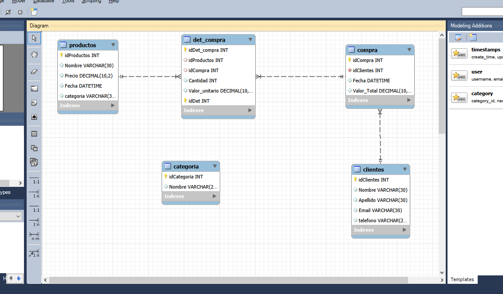

# 🛒 TiendaDB

## 📖 Descripción

TiendaDB es un proyecto de base de datos relacional desarrollado en MySQL como parte de mi formación en SQL.

Simula la gestión de una tienda mediante el almacenamiento de información sobre clientes, productos, compras y detalle de compras.

---

## 🛠 Tecnologías utilizadas

- MySQL
- SQL
- MySQL Workbench
- Visual Studio Code

---

## 📂 Contenido

- `tiendadb.sql` → Base de datos completa.
- `consultas.sql` → Consultas SQL desarrolladas para practicar y demostrar conocimientos.

---

## 📊 Modelo Entidad-Relación

---

## 💡 Habilidades demostradas

- Diseño de bases de datos relacionales
- Creación de tablas
- Claves primarias y foráneas
- Consultas SQL
- INNER JOIN
- GROUP BY
- HAVING
- Funciones de agregación
- Subconsultas

---

## 🚀 Mejoras futuras

- Normalizar la relación entre productos y categorías.
- Cambiar `Valor_Total` a tipo `DECIMAL`.
- Implementar Vistas (VIEW).
- Incorporar Procedimientos Almacenados.
- Agregar Triggers.

---

## 👨‍💻 Autor

**Andrés Robertiello**

Proyecto desarrollado como parte de mi portafolio personal de SQL y Bases de Datos.

## 📌 Decisiones de diseño

Durante el desarrollo de este proyecto realicé algunas mejoras respecto del diseño original:

- Se modificó el campo `telefono` de la tabla `clientes` al tipo `VARCHAR(20)` para permitir formatos con códigos de área y prefijos internacionales.
- Se cambió el campo `Valor_Total` de la tabla `compra` al tipo `DECIMAL(10,2)` para almacenar importes y realizar cálculos correctamente.

